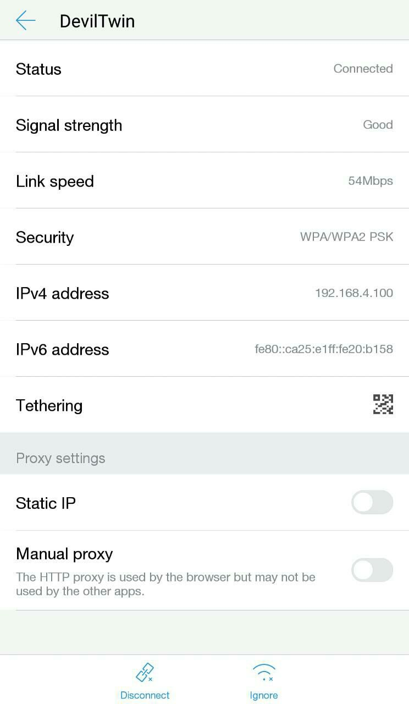
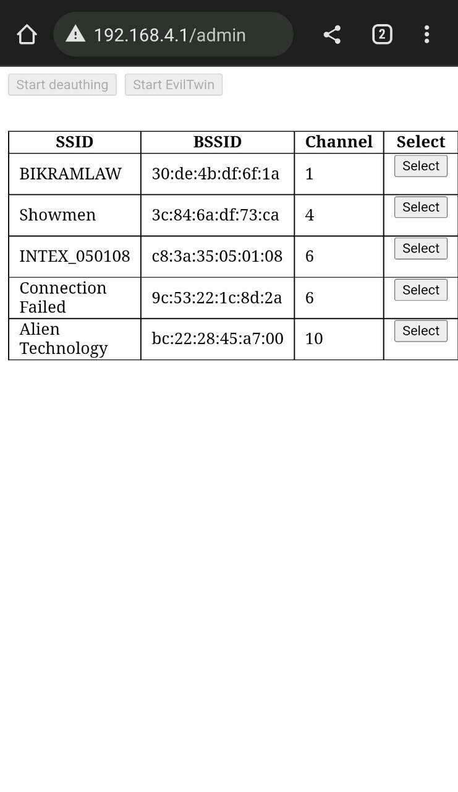
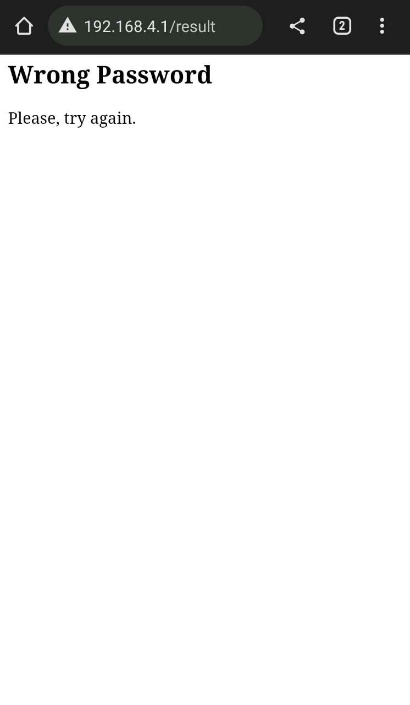

    
	 
    

      
  
  
  
  
  
  
	
	
	

   

# DevilTwin NodeMCU

An evil twin attack is a spoofing cyberattack that works by tricking users into connecting to a fake Wi-Fi access point that mimics a legitimate network. Once a user is connected to an “evil twin” network, hackers can access everything from their network traffic to private login credentials.

## About This Project

Welcome to the project DevilTwin. This Exactly Works like the Evil Twin Attack. This is a simple project to demonstrate how easy it is to capture data from a Wi-Fi network. This project is based on the ESP8266 and uses the Arduino framework. It is able to de-authentificate clients of a given Wi-Fi network continuously. 

This is possible due to a vulnerability in the Wi-Fi protocol (WPA/WPA2). This attack is performed by forcing the client(s) to de-authenticate themselves from the access point, then capturing the 4-way handshake when attempting to reconnect to the access point.

After that, the handshake can be brute forced to reveal the password of the access point. This attack is performed on the access point itself, not the clients. It is highly effective on most modern Wi-Fi networks.

You don't even need to brute force the handshake, the NodeMCU Board will act as the access point that you wanted to attack, and will show a fake firmware update page, and when the user enters the password, it will be shown on the admin page of the NodeMCU Board.

Even if the user enters the wrong password, it will be shown to the user that a wrong password is entered, and the user will be redirected to the same page again. This will make the user think that the password is wrong, and he will enter the correct password, and the password will be shown on the admin page of the NodeMCU Board.

> Use this tool only on networks that you have permission for.

## Change Log

- Removed AsyncWebServer due to performance and stability
- Reworked deauthing - now it changes channel so deauthing can work properly

> Note: This Project Is Licensed Under MIT License and Is Only for Educational Purposes. I Am Not Responsible for Any Misuse of This Project.

## Installation (ESP8266 Flasher - Easy way)

1. Download **[ESP8266 Flasher](https://github.com/nodemcu/nodemcu-flasher)**.

2. Download the **[DevilTwin-NodeMCU.ino.bin](https://github.com/OCEANOFANYTHINGOFFICIAL/DevilTwin-NodeMCU/raw/main/DevilTwin-NodeMCU/build/esp8266.esp8266.generic/DevilTwin-NodeMCU.ino.bin)** file.

3. Open the ESP8266 Flasher and select the Node MCU port

4. Then, go to the config tab and select the .bin file you've just downloaded.

5. Finally, go back to the first tab and press "Flash"

6. Your Node MCU is ready!

# Installation (Arduino IDE)

1. Open your <a href="https://www.arduino.cc/en/main/software">Arduino IDE</a> and go to "File -> Preferences -> Boards Manager URLs" and paste the following links (You Can Use Multiple Links Separated By Commas): ``https://dl.espressif.com/dl/package_esp32_index.json, http://arduino.esp8266.com/stable/package_esp8266com_index.json``

2.  Go to "Tools -> Board -> Boards Manager", search "esp8266" and install esp8266

3.  Then Go To "Tools -> Manage Libraries", search "Senses_wifi" and install `Senses_wifi`

4. Go to "Tools -> Board" and select your board

5. Download and open the sketch "<a href="https://github.com/OCEANOFANYTHINGOFFICIAL/DevilTwin-NodeMCU/blob/main/DevilTwin-NodeMCU/DevilTwin-NodeMCU.ino"><b>DevilTwin-NodeMCU.ino</b></a>"

6. You can optionally change some parameters like the SSID name and texts of the page like title, subtitle, text body etc.

7. Upload the code into your board.

8. You are done!

> Note: Deauthing might not work on some phones due to the fact that this project uses broadcast as station target (attacks everyone on network and not specific client).

  

#  Usage Instructions

  

1. Connect to the AP named "DevilTwin" with password "12345678" from your phone/PC.

2. Select the target you want (list of available APs refreshes every 30secs - page reload is required)

  

3. Click the Start Evil-Twin button and reconnect to the newly created AP named same as your target (will be open)

4. After connecting, make sure you choose "Use this network as is" (may differ on different devices)

5. Go to your favorite browser and navigate to ``192.168.4.1/admin``

6. Once there DO NOT change your target, only start/stop deauthing and wait for someone to try and use the correct password.

7. If the user enters a password, and the password does't matches the handshake file, an error message will be shown to the user and the user will be asked to enter the correct password.

8. Once correct password is found, AP will be restarted with default ssid "DevilTwin" with password "12345678" and at the bottom of a table you should be able to see something like "Successfully got password for - SSID - Password

> If you have any questions, feel free to post in the issues section